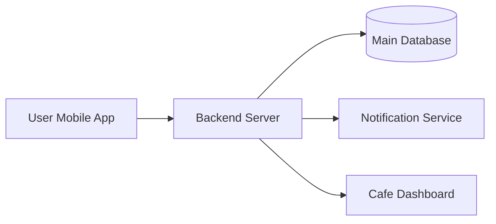
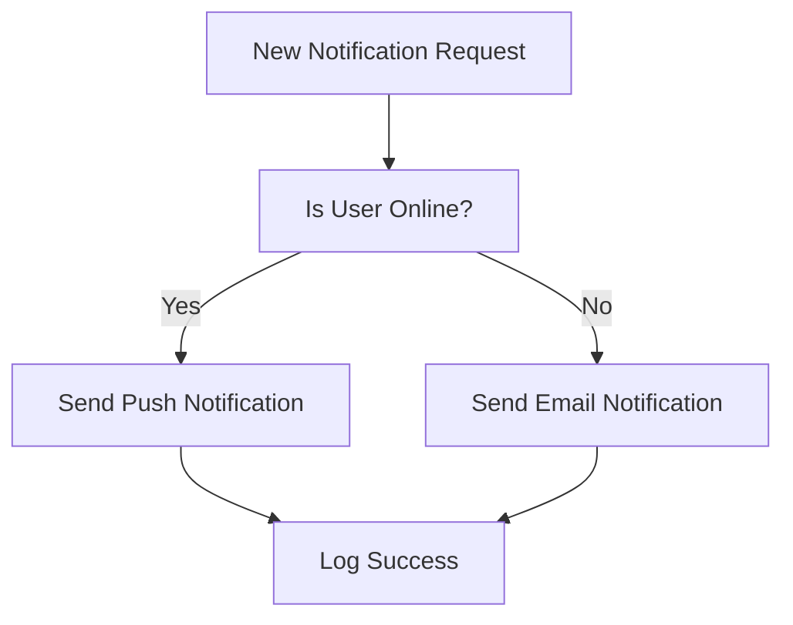

# High-Level Design (HLD) vs. Low-Level Design (LLD)

In system design, we move from a broad idea to a detailed implementation. Understanding where HLD ends and LLD begins is important for anyone learning to build software.

---

## Visualizing the Difference

### High-Level Design (The Architecture)
This shows how different systems connect to each other.

### Low-Level Design (The Internal Logic)
This shows what happens inside one of those boxes (e.g., inside the Notification Service).

---

## 1. High-Level Design (HLD): The Big Picture

High-Level Design, often called System Architecture, looks at the entire system from a distance. It describes how different parts of the system are connected and how they talk to each other.

### Key Characteristics:
- Scope: The entire system or application.
- Focus: What the system does and how major components interact.
- Audience: Everyone involved in the project, including managers and architects.
- Outcome: Diagrams showing major services, database choices, and the general flow of data.

Think of it as: A map of a whole city that shows where the parks, schools, and main roads are. It doesn't show the inside of the houses, just where they are located.

---

## 2. Low-Level Design (LLD): The Fine Details

Low-Level Design, or Detailed Design, zooms in on the individual parts identified in the HLD. It explains the specific logic that makes each part work.

### Key Characteristics:
- Scope: One specific module or component at a time.
- Focus: How the code is written and how the internal logic works.
- Audience: The developers who will actually write the code.
- Outcome: Detailed diagrams of classes, specific function names, and exact data structures.

Think of it as: A detailed floor plan for a single house. It shows exactly where the light switches are, how the pipes are laid out, and which way the doors open.

---

## Comparison at a Glance

| Feature | High-Level Design (HLD) | Low-Level Design (LLD) |
| :--- | :--- | :--- |
| Primary Goal | Define the components and how they connect. | Define the internal logic of each component. |
| Visual Tools | General flowcharts and block diagrams. | Class diagrams and sequence diagrams. |
| Who creates it? | System Architect. | Developers and Technical Leads. |
| Nature | High-level and abstract. | Detailed and ready for coding. |

---

## The Student-Friendly Example: "Campus Coffee Delivery App"

Imagine you are building an app that lets students order coffee from the campus cafe and have it delivered to their classroom.

### The HLD Approach (The "What")
You decide the main parts of your system:
1. User App: For students to place orders.
2. Cafe App: For the barista to see what coffee to make.
3. Database: To keep track of the menu and orders.
4. Notification System: To tell students their coffee is on the way.

Outcome: You draw a simple diagram showing a student's phone connecting to a server, which then sends information to the cafe's tablet.

### The LLD Approach (The "How")
Now you zoom into just the **"Notification System"**:
1. Class Names: You decide to name your main class `OrderNotifier`.
2. Function Logic: You write a rule that says "If the push notification fails, send an email instead."
3. Data Storage: You decide to store the notification history in a simple list sorted by time.

Outcome: You have a detailed plan that a developer can follow to start writing the actual code immediately.

---

## Conclusion: How they work together
HLD and LLD are two sides of the same coin. The HLD gives you the framework (the skeleton), and the LLD gives you the details (the logic). You need the HLD to understand the "Big Picture" and the LLD to actually build it.
