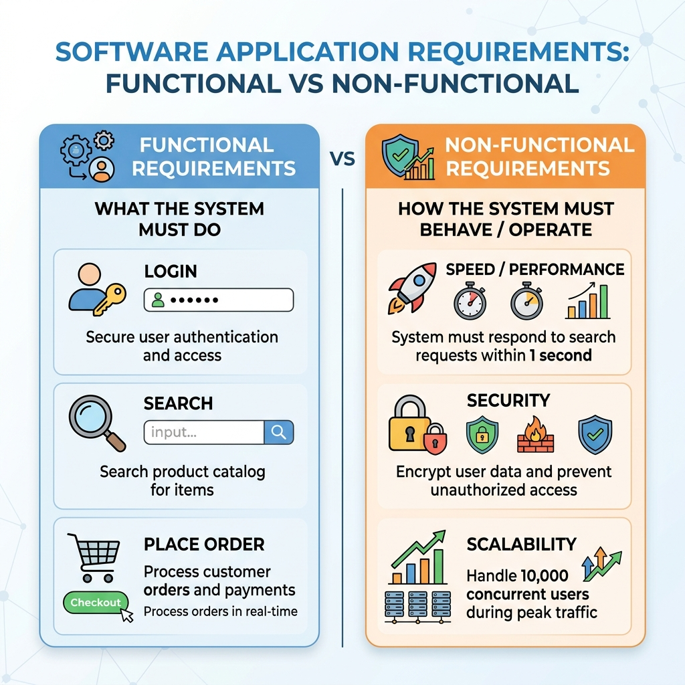

# Functional vs. Non-Functional Requirements

When we design a system, we need to understand two things: what the system should **do** and how the system should **be**. These are called Functional and Non-Functional requirements.

---

## 1. Functional Requirements (FR)

Functional requirements describe the specific features and behaviors of the system. They are the "must-do" actions that the software performs when a user interacts with it.

### Examples of Functional Requirements:
- The system must allow users to log in with an email and password.
- The system must provide a search bar to look for products.
- The system must send a confirmation email after a successful purchase.
- The system must allow users to reset their passwords.

**Key Question**: What does the user want to achieve?

---

## 2. Non-Functional Requirements (NFR)

Non-functional requirements describe the quality and constraints of the system. They don't define specific features, but rather how the system behaves under different conditions. These are often called "Quality Attributes" or "-ilities" (Scalability, Reliability, Availability).

### Examples of Non-Functional Requirements:
- **Performance**: The search results must appear in less than 2 seconds.
- **Scalability**: The system must handle 10,000 concurrent users during a sale.
- **Security**: All user data must be encrypted before being stored.
- **Availability**: The system should be up and running 99.9% of the time.

**Key Question**: How well should the system perform its functions?

---

## Visual Comparison

---

## The Student-Friendly Example: "Food Delivery App"

Imagine you are building an app like Zomato or Swiggy.

### Functional Requirements (The Features)
- A student can search for "Biryani" in the search bar.
- A student can add a "Coke" to their cart.
- A student can pay using UPI or a Credit Card.
- The app shows a live map of where the delivery partner is.

### Non-Functional Requirements (The Quality)
- **Speed**: The app should open and show nearby restaurants in under 1 second.
- **Reliability**: If the internet drops for a second, the app shouldn't crash; it should show a "Reconnecting" message.
- **Scalability**: On Friday nights (peak time), the app should still work smoothly even if millions of people are ordering at once.
- **Security**: The student's payment details must be kept completely private and safe.

---

## Summary Table

| Feature | Functional Requirements | Non-Functional Requirements |
| :--- | :--- | :--- |
| **Focus** | "What" the system does. | "How" the system performs. |
| **User View** | Directly visible as features. | Not always visible, but deeply felt as experience. |
| **Mandatory?** | Yes, the app won't work without them. | Yes, the app will be "bad" or "unusable" without them. |
| **Examples** | Login, Search, Checkout. | Speed, Security, Scalability. |
